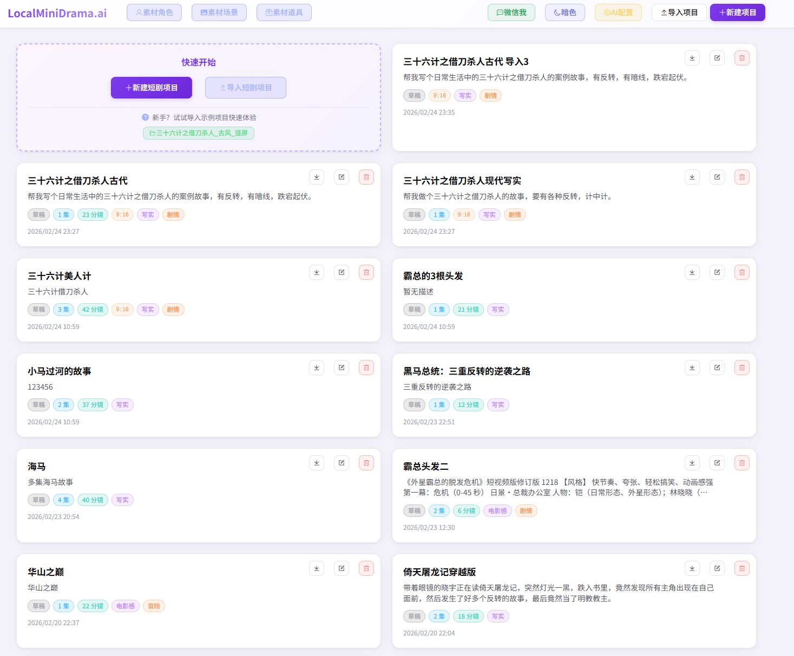

<div align="center">

# 🎬 LocalMiniDrama

**本地 AI 短剧 & 漫剧生成工具 —— 下载即用，完全开源，数据不出本机**

[](../../releases)
[](LICENSE)
[](#)
[](#)
[](../../pulls)

**[English](docs/en.md) | 简体中文 | [作者故事](docs/story.md)**

</div>

---

市面上 AI 短剧工具不少，但真正能**本地离线运行、开箱即用、素材不上云**的几乎没有。  
本项目用纯 JavaScript 从零搭建，接入你自己的 AI API，打开即可生成完整 AI 短剧。

> ✅ 无订阅费 · ✅ 数据本地存储 · ✅ 支持多家 AI 服务商 · ✅ 完全开源可二次开发

---

## 📸 界面预览

<div align="center">
  <br/>
  <sub>首页 · 项目卡片一览，亮色模式</sub>
</div>

<br/>

<table>
  <tr>
    <td align="center"><br/><sub>剧集管理 · 分集 + 资源库</sub></td>
    <td align="center"><br/><sub>分镜制作 · 图片 + 视频一键生成</sub></td>
  </tr>
</table>

---

## ✨ 核心功能

### 🔄 完整创作流程

| 步骤 | 功能 | 说明 |
|:----:|------|------|
| 1 | **故事生成** | 输入梗概 + 风格，AI 自动生成多集剧本 |
| 2 | **剧本编辑** | 分集管理，剧本文本可自由编辑 |
| 3 | **角色生成** | AI 提取角色列表，逐个生成角色形象图 |
| 4 | **场景生成** | 从剧本自动提取场景，生成场景背景图 |
| 5 | **道具生成** | 从剧本提取/手动添加道具，生成道具图 |
| 6 | **分镜生成** | 按集自动生成分镜脚本（含景别/运镜/台词） |
| 7 | **图片/视频生成** | 逐镜生成静帧图与视频片段 |
| 8 | **合成视频** | 所有分镜视频自动合成为完整剧集文件 |

### ⚡ 一键流水线

- **一键生成视频**：从角色图到最终合成视频，全程自动执行
- **补全并生成**：智能跳过已有内容，只补全缺失部分
- **失败自动重试**：每步最多重试 3 次，应对 429 限流等错误，不中断流程
- **实时进度展示**：执行过程中展示当前步骤与完整错误日志

### 🗂 项目与资源管理

- **工程导出/导入**：完整打包工程为 ZIP（含图片、视频、文字、配置），换机或分享一包搞定
- **素材库**：全局角色/场景/道具库，跨项目复用；各项目资源严格隔离
- **画面比例**：新建项目时选定比例（16:9 / 9:16 / 1:1 等），后续生成全程适配
- **分集管理**：支持新增/删除分集，剧本预览

### ✏️ 分镜精细编辑

- **图片提示词**：查看并编辑每个分镜的图片生成提示词，修改后重新生成
- **视频提示词**：全文编辑 + 字段展开编辑（场景/时长/动作/氛围/运镜/景别），自动重新拼装
- **图片管理**：AI 生成、手动上传、拖拽上传，随时替换

### 🤖 AI 配置

- 图片生成、视频生成、文本生成三类模型**独立配置**
- 兼容 **阿里云 DashScope**、**火山引擎 Volcengine**、**本地部署模型** 及其他 OpenAI 兼容接口
- 可视化管理，保存即生效，支持**一键测试连接**
- 内置「一键配置通义」「一键配置火山」快捷入口，含 API Key 申请引导

### 🌓 界面体验

- 支持**亮色模式**（默认）与**暗色模式**切换，偏好持久保存
- 高级设置：支持**自定义 AI 提示词**（故事生成、分镜拆解、角色/场景/道具提取等 9 个），可随时一键恢复默认
- 三个主页面均可随时切换主题

---

## 🚀 快速开始

### 方式一：下载 exe（推荐普通用户）

前往 **[Releases](../../releases)** 下载最新版，每次发布提供两个版本：

| 文件名 | 说明 | 推荐人群 |
|--------|------|----------|

| `LocalMiniDrama x.x.x.exe` | 标准版免安装便携版 | 首次使用，含示例项目 |

| `LocalMiniDrama-Lite-x.x.x.exe` | Lite 版免安装便携版 | 已熟悉使用，包体更小 |

> **标准版 vs Lite 版**：标准版内置一个示例短剧项目，打开即可查看完整创作流程示例，适合新手上手参考；Lite 版不含示例数据，包体更小，适合已了解使用方式的用户。功能完全一致。

双击运行 → 在软件「AI 配置」页填入你的 API Key → 开始创作。

> 首次运行会在 `%APPDATA%\LocalMiniDrama\backend\configs\config.yaml` 生成配置文件。

### 方式二：开发模式运行

> 需要 Node.js >= 18

```bash
# 1. 克隆项目
git clone https://github.com/your-username/LocalMiniDrama.git
cd LocalMiniDrama

# 2. 启动后端（默认端口 5679）
cd backend-node
npm install
cp configs/config.example.yaml configs/config.yaml
# 编辑 config.yaml，填入 AI API 地址与密钥
npm run migrate   # 首次运行：初始化数据库
npm start

# 3. 启动前端（新开终端，默认端口 3013）
cd frontweb
npm install
npm run dev
```

浏览器访问 `http://localhost:3013` 即可。

也可双击根目录的 `run_dev.bat` **一键同时启动**前端和后端。

📖 更详细的开发、打包、Docker 指南请见 → **[快速开始文档](docs/quickstart.md)**

---

## 🤖 AI 服务商支持

| 服务商 | 文本生成 | 图片生成 | 视频生成 |
|--------|:--------:|:--------:|:--------:|
| 阿里云 DashScope（通义） | ✅ | ✅ | ✅ |
| 火山引擎 Volcengine（豆包） | ✅ | ✅ | ✅ |
| NanoBanana（含代理，如星衍云） | — | ✅ | — |
| 本地部署（Ollama 等 OpenAI 兼容） | ✅ | — | — |
| 其他 OpenAI 兼容接口 | ✅ | ✅ | — |

📖 各服务商 API Key 申请与配置详见 → **[AI 配置指南](docs/configuration.md)**

---

## 🏗 项目架构

```
LocalMiniDrama/
├── backend-node/          # Node.js 后端（Express + SQLite）
│   ├── src/
│   │   ├── config/        # 配置加载（YAML）
│   │   ├── db/            # SQLite 连接与迁移
│   │   ├── services/      # 业务逻辑（生成服务、导出导入等）
│   │   └── routes/        # REST API 路由
│   └── configs/           # config.yaml 配置文件
├── frontweb/              # Vue 3 前端（Vite + Element Plus）
│   └── src/
│       ├── views/
│       │   ├── FilmList.vue      # 首页：项目列表、素材库
│       │   ├── DramaDetail.vue   # 剧集管理：信息/分集/资源库
│       │   └── FilmCreate.vue    # 制作页：剧本/角色/分镜/生成
│       ├── api/                  # 后端 API 封装
│       ├── stores/               # Pinia 状态管理
│       └── styles/               # 全局样式（主题变量）
├── desktop/               # Electron 桌面壳（打包 exe）
├── docs/                  # 文档目录
└── README.md
```

**技术栈：**

| 层 | 技术 |
|----|------|
| 前端 | Vue 3 + Vite + Element Plus + Pinia + Axios |
| 后端 | Node.js + Express + SQLite (better-sqlite3) |
| 桌面 | Electron 28 + electron-builder |
| 语言 | 纯 JavaScript（无 TypeScript） |

---

## 📋 版本历史

查看完整更新记录 → **[CHANGELOG](docs/changelog.md)**

**最新版 v1.1.8 亮点：**
- 🆕 **NanoBanana 图片厂商**：新增 NanoBanana 作为独立图片生成厂商，支持 nano-banana-2 / nano-banana-pro / nano-banana 三个模型，兼容官方 API 与代理模式（如星衍云）
- 🆕 **AI 配置导出 / 导入**：一键导出全部 AI 配置为 JSON 文件，换机或分享配置直接导入
- 🆕 **端点字段可配置**：图片/分镜/视频类型均可手动填写提交端点与查询端点，方便对接各类代理或自定义服务
- 🔧 **分镜参考图优化**：角色图和场景参考图优先读取本地文件并转为 base64，彻底解决外链过期导致生成失败的问题
- 🔧 **doubao-seedream 参数修正**：参考图字段名修正为官方规范（`image`），自动关闭水印，适配自定义代理

**v1.1.7 亮点：**
- 🆕 **UI 全面美化**：紫色主题 + 亮色模式默认，卡片/按钮/表格视觉大幅升级
- 🆕 **提示词高级设置**：9 个核心 AI 提示词可自定义，JSON 格式部分加锁保护，一键恢复默认
- 🆕 **AI 厂商自定义选项**：下拉菜单支持直接输入自定义厂商名
- 🔧 **提示词持久化**：自定义内容通过 SQLite 存储，重启不丢失

---

## 🎯 适合谁

| 用户类型 | 场景 |
|----------|------|
| 📹 内容创作者 | 快速批量生产 AI 短剧 / 漫剧 |
| 🔒 隐私敏感用户 | 素材不上传云端，数据完全自控 |
| 🛠 开发者 | 在此基础上二次开发、扩展 AI 服务商 |
| 🌱 入门探索者 | 低成本体验 AI 视频赛道 |

---

## 🔗 同类工具参考 & 致谢

| 工具 | 特点 |
|------|------|
| **Kino 视界** | 国内活跃的 AI 短剧平台，云端为主，非开源 |
| **Filmaction AI** | AI 自动生成剧情/分镜/配音，SaaS/Web 端，部分付费 |
| **[Toonflow](https://github.com/toonflow)** | 开源 AI 漫画/短剧流程工具，流程设计对本项目有所启发 |
| **[openoii / oiioii](https://github.com/oiioii)** | 开源，轻量化 AI 可视化创作，本项目在提示词设计上有所参考 |
| **ChatFire** | AI 驱动剧情生成/对话体短剧，启发了本项目后端设计 |

本项目更聚焦于**本地离线、界面友好、方便二次开发**，欢迎 [Issue](../../issues) 推荐更多工具。

---

## 🗺 后续计划 Roadmap

以下功能正在规划或开发中，欢迎参与讨论与贡献：

| 计划 | 说明 |
|------|------|
| ✅ **即梦 2.0 模型接入** | 已支持豆包 Seedream 4.5 图片生成 |
| ✅ **NanoBanana 图片模型接入** | 已支持，含官方 API 与代理模式（v1.1.8） |
| 📎 **分镜参考图自由上传** | 分镜编辑支持自由上传任意图片作为参考图 |
| 🎨 **参考图自由选择** | 生成分镜图时，可手动指定使用哪些角色/场景图片作为参考 |
| 🔲 **宫格图生成视频** | 支持将多帧宫格合图作为输入生成视频片段（部分模型已支持） |

> 有好想法或愿意认领某项开发？欢迎 [提 Issue](../../issues/new) 或直接提 PR！

---

## 🤝 参与贡献

欢迎任何形式的贡献！

- 🐛 **报告 Bug** → [新建 Issue](../../issues/new)
- 💡 **功能建议** → [新建 Issue](../../issues/new)
- 🔧 **提交代码** → Fork → 修改 → Pull Request
- ⭐ **给项目 Star** → 帮助更多人发现这个工具

---

## 💬 联系 & 社区

一个游戏搬砖工，用自己熟悉的 JavaScript 做了这个开源项目，先做了再说。

想了解项目诞生的完整故事？👉 [作者故事 & 碎碎念](docs/story.md)

有任何建议、交流、合作，欢迎加微信，或扫码加入**用户交流群**：

<table>
  <tr>
    <td align="center">
      <br/>
      <sub>加作者微信</sub>
    </td>
    <td align="center">
      <br/>
      <sub>扫码进群（二维码定期更新）</sub>
    </td>
  </tr>
</table>

> 微信群二维码有效期约 7 天，过期请加作者微信拉入群。

---

## 📄 License

[MIT](LICENSE)

---

<div align="center">

**如果这个项目对你有帮助，请点一下 ⭐ Star，这是对作者最大的鼓励！**

</div>
