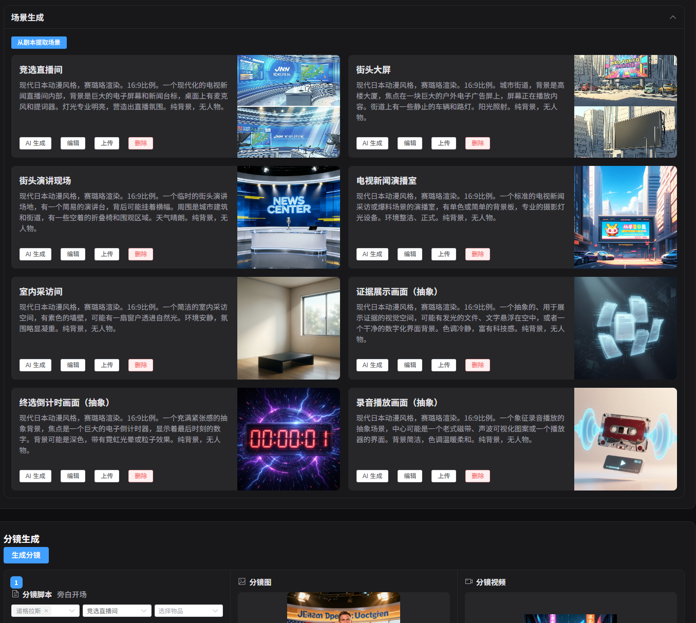
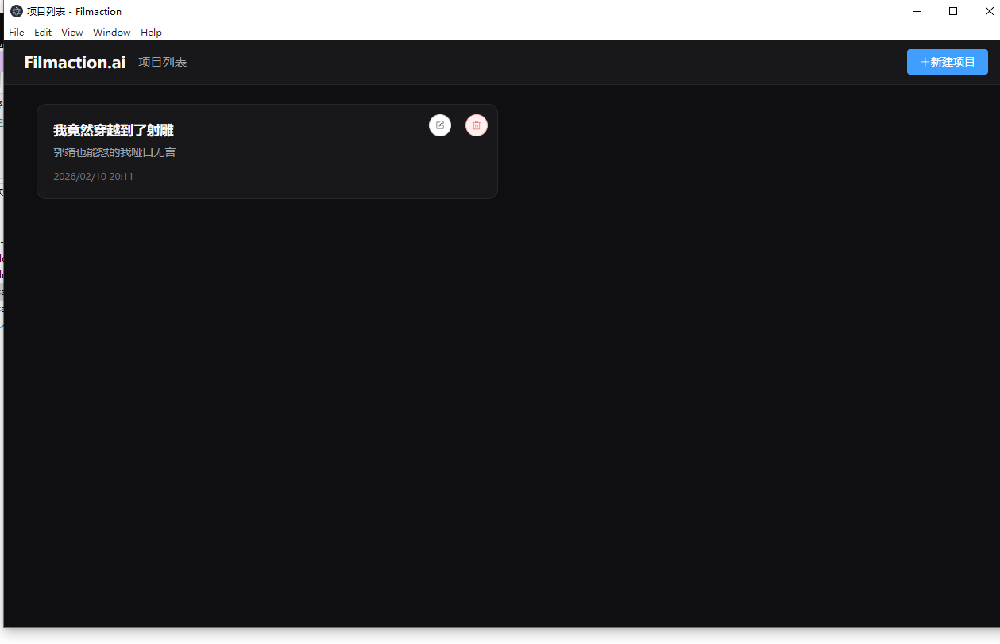
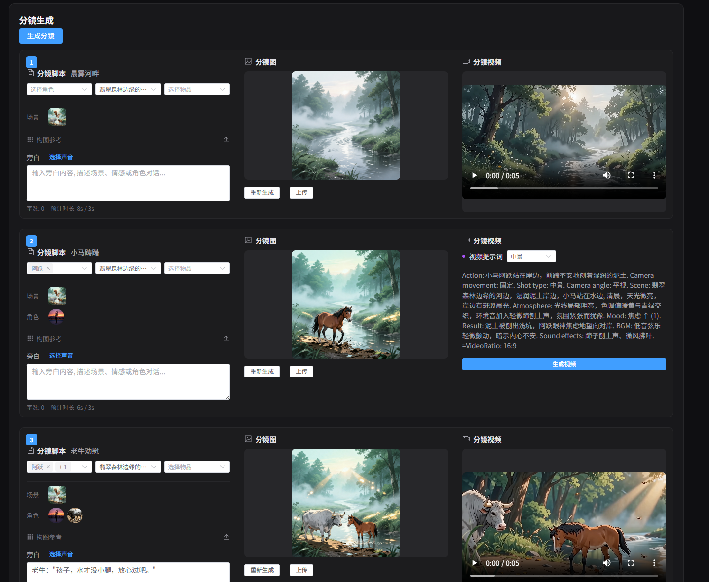

# LocalMiniDrama

# 项目说明

短剧生成的项目这两年逐渐多了起来，市面上各种AI短剧生成工具层出不穷，但坦率说，真正开源、能够在本地桌面环境下直接运行，无需繁琐配置的项目依然凤毛麟角。很多产品要么仅有网页版，要么是闭源平台，要么部署方式极为复杂，门槛很高。正因如此，开发这个本地AI短剧生成桌面端的初衷，就是让更多用户能够下载即用，无需科学上网，无需多环境依赖，打开软件就能直接生成属于自己的AI短剧。省心省事，兼顾隐私，对于大众普通用户和开发者来说都更加友好。这也是我坚持做这个项目并开源发布的主要原因之一：希望推动短剧AI工具往易用、本地化方向发展，为有相关需求的同好提供一个开源、可自定义的选择，让AI短剧真正跑在你自己的电脑上，随时随地都能体验。
关于大模型的部署，我这里不做介绍，部署完在配置填入网址就行。

# 项目截图

以下为本项目的主要界面截图，展示了从启动到生成短剧的主要功能界面：






# 介绍

一个轻量、离线、纯前端的 AI 短剧 & 漫剧生成工具，用 JavaScript 从零搭建，专注于简单、快速、本地可用。
不用复杂环境，接入本地的生成api后，打开就能用，本地直接跑。如果没有可以用云端的api输入就行，完全开源，接受代码审查，不用担心素材泄露。

# ✨ 核心功能

## 完整创作流程

| 步骤 | 功能 | 说明 |
|------|------|------|
| 1 | 故事生成 | 输入梗概 + 风格/类型，创建项目并生成剧本 |
| 2 | 剧本编辑 | 编辑剧本、标题/语言/分镜风格 |
| 3 | 角色生成 | AI 生成角色列表，每个角色可生成形象图 |
| 4 | 场景生成 | 从剧本提取场景，每个场景可生成图片 |
| 5 | 道具生成 | 从剧本提取/手动添加道具，可生成道具图 |
| 6 | 分镜生成 | 根据当前集自动生成分镜脚本 |
| 7 | 分镜图/视频生成 | 逐个分镜生成图片和视频片段 |
| 8 | 合成视频 | 将所有分镜视频合成为完整剧集 |

## 一键生成与智能补全

- **一键生成视频**：从角色图片 → 场景图片 → 分镜脚本 → 分镜图片 → 分镜视频 → 合成视频，全流程自动执行，每步之间自动休息 1 秒防止队列过载
- **补全并生成**：智能检测已有内容，只生成缺失的元素（跳过已有角色图、场景图、分镜图片、视频），最后自动合成完整视频
- **失败重试**：每个生成步骤自动重试 3 次（应对 429 限流等错误），3 次均失败后记录错误继续下一个任务
- **实时进度**：执行过程中实时显示当前步骤和所有错误日志

## 分镜编辑

- **图片提示词**：每个分镜可查看和编辑用于生成分镜图的图片提示词（image_prompt），修改后可重新生成图片
- **视频提示词**：
  - **手工编辑**：直接编辑完整的视频提示词文本（默认只显示 2 行预览，点击展开编辑）
  - **组成字段编辑**：展开「视频提示词组成」面板，逐字段编辑标题、场景、时间、时长、角色动作、氛围情绪、镜头角度、运镜方式、景别等，保存后自动重新拼装视频提示词
- **景别选择**：大远景、远景、中景、近景、特写，集成在视频提示词组成面板中统一编辑
- **分镜图管理**：支持 AI 生成、手动上传、拖拽上传，已有图片时可重新生成或替换
- **分镜视频**：支持生成、预览、重新生成，提示词可调整后重新生成视频

## AI 模型配置

- 支持配置图片生成模型、视频生成模型、文本生成模型
- 兼容阿里云 DashScope、本地部署模型等多种 API
- 在「AI 配置」页面可视化管理，保存后即时生效

# 项目架构

```
LocalMiniDrama/
├── backend-node/          # Node.js 后端（Express + SQLite）
│   ├── src/
│   │   ├── config/        # 配置加载 (YAML)
│   │   ├── db/            # SQLite 连接与迁移
│   │   ├── services/      # 业务逻辑
│   │   │   ├── dramaService.js          # 剧本 CRUD
│   │   │   ├── episodeStoryboardService.js  # 分镜生成与提示词组装
│   │   │   ├── storyboardService.js     # 分镜 CRUD
│   │   │   ├── taskService.js           # 异步任务管理
│   │   │   └── ...
│   │   └── routes/        # API 路由
│   ├── migrations/        # 数据库迁移脚本
│   └── configs/           # 配置文件 (config.yaml)
├── frontweb/              # Vue 3 前端（Vite + Element Plus）
│   ├── src/
│   │   ├── views/
│   │   │   └── FilmCreate.vue   # 核心创作页面（单页完成全部流程）
│   │   ├── api/           # 后端 API 封装
│   │   ├── stores/        # Pinia 状态管理
│   │   └── utils/         # 工具函数
│   └── vite.config.js
├── desktop/               # Electron 桌面壳（打包 exe）
└── README.md
```

## 技术栈

| 层 | 技术 |
|----|------|
| 前端 | Vue 3 + Vite + Element Plus + Pinia + Axios |
| 后端 | Node.js + Express + SQLite (better-sqlite3) |
| 桌面 | Electron + electron-builder |
| 语言 | 纯 JavaScript（无 TypeScript） |

# 快速开始

## 1. 启动后端

```bash
cd backend-node
npm install
cp configs/config.example.yaml configs/config.yaml
# 按需修改 config.yaml（填入 AI 模型 API 地址等）
npm run migrate   # 首次运行：初始化数据库
npm start         # 启动服务（默认端口 5679）
```

## 2. 启动前端

```bash
cd frontweb
npm install
npm run dev       # 开发模式（默认端口 3013，代理到后端 5679）
```

## 3. 打包桌面 exe（可选）

```bash
cd desktop
npm install
npm run dist      # 构建 Windows 安装包与便携版 exe
# 国内网络使用镜像：
npm run dist:cn
```

详见 [desktop/README.md](desktop/README.md)。

# 🎯 适合谁

- 想快速做 AI 短剧 / 漫剧的创作者
- 不想泄露内容的隐私党
- 喜欢折腾、自己改工具的开发者
- 想入门短剧行业，但不想先花钱的新手

# 📌 定位

这不是一个完美的商业产品，而是一个热爱技术、热爱创作的普通人，在风口里不断尝试、不断纠结、不断前进的痕迹。
如果你也在：内容 / 工具 / 短剧 / AI / 游戏开发 之间反复横跳，欢迎一起玩、一起改、一起把它变得更强。

# 相关对标及类似短剧生成工具

本项目关注本地部署与易用性的短剧（AI漫剧/AI视频/AI解说）生成桌面工具，当前市面上较为知名或具有代表性的对标产品、同类软件包括但不限于：

- **Kino视界**  
  国内较为活跃的AI短剧生成平台，侧重于AI生成与剧本可视化，支持云端编辑与分享，但非本地化开源部署。

- **Filmaction AI**  
  主打AI自动生成剧情、分镜和配音的产品，强调创作者效率提升，支持成品下载，部分功能付费，仍以SaaS/Web端为主。

- **oiioii**  
  兼具AI视频/漫画/短剧生成能力，原为开源项目，定位为轻量化AI可视化创作工具，部署灵活，较适合技术爱好者。

- **ChatFire（chatfire）**  
  以AI驱动的剧情生成/对话体短剧创作工具，支持多端发布和API对接，启发了本项目后端及剧本生成部分的设计思路。

- 其它如 **AIGC剧本工厂**、**画冰AI剧本**、**追更短剧AI** 等平台/工具，部分主打面向短视频自媒体/创作者群体，或提供API作为SaaS接口。

本项目在功能和定位上更贴近"本地免配置、界面友好、方便二开"，欢迎参考上述工具的优缺点，与本地桌面版体验进行对比。若有更多优秀的同类产品，欢迎Issue补充交流。

# 项目开发说明

### 开发碎碎念（主打一个纠结到发疯版）

本人，一个平平无奇的游戏搬砖工，作为一个程序但是一直想主导产品，每天在各种AI软件里左右横跳、反复横跳——今天觉得这个AI好用，明天觉得那个AI更香，主打一个没定性

## 我的微信

下方是我的微信二维码，有任何建议、交流、合作欢迎扫码加我。


看着短视频行业的东风吹得漫天响，脑子一热就想扎进AI漫剧赛道，但问题来了：我到底干啥啊？？

纠结点1：老老实实搬砖？不甘心，觉得浪费风口；

纠结点2：搞AI剧发行？没资源没渠道，心里发慌；

纠结点3：自己做AI剧/AI解说剧？又怕做出来没人看，纯属白费功夫；

纠结点4：搞AI剧Agent开发？好像有点技术含量，但又怕超出自己能力范围；

咱就是说，闲不住星人实锤，纠结到头发掉一把，也没定下来主攻哪个方向。索性参考了市面上一堆同类软件，想起自己就只会点JavaScript，那就瞎琢磨着做了这个开源项目

### 项目定位（依然很纠结版）

- 说它是练手？好像又有点想往商业化靠；说它是商业化雏形？又觉得自己没那个底气；

- 开源吧，一方面想分享点自己瞎琢磨的技术，跟同好交流交流；另一方面也想抱开源社区的大腿，帮我优化优化，省得我自己瞎折腾；

- 至于未来？随缘吧，纠结归纠结，先做了再说，万一哪天就不纠结了（也万一哪天就放弃了），至少还留下点东西，也希望能碰到同样纠结着入局AI漫剧的朋友，一起唠唠、一起进步～


# ✨ 特性
纯前端 / 离线运行，保护隐私
轻量化，开箱即用，无需复杂配置
支持短剧文案生成、分镜结构、剧情编排
适合个人创作者、短剧爱好者、独立开发者
完全开源，可自由扩展、二次开发
# 🎯 适合谁
想快速做 AI 短剧 / 漫剧的创作者
不想泄露内容的隐私党
喜欢折腾、自己改工具的开发者
想入门短剧行业，但不想先花钱的新手
# 📌 定位
这不是一个完美的商业产品，而是一个热爱技术、热爱创作的普通人，在风口里不断尝试、不断纠结、不断前进的痕迹。
如果你也在：内容 / 工具 / 短剧 / AI / 游戏开发 之间反复横跳，欢迎一起玩、一起改、一起把它变得更强。

## 本地桌面客户端（exe）

如需打包成 Windows 单机 exe，使用仓库中的 Electron 壳：

- 后端：`backend-node`
- 前端：`frontweb`
- 桌面壳：`desktop/`（Electron + electron-builder）

打包步骤见 [desktop/README.md](desktop/README.md)。在 `desktop` 目录执行 `npm install` 后运行 `npm run dist` 即可生成安装包与便携版 exe。

# 参考

项目参考了Kino视界，Filmaction AI ，还参考了oiioii，本来是打算做 oiioii的平替产品的，然后可以本地运行的，后来发现积累不够，开源的主要是参考了chatfire，chatfire的帮助最大，只是他的服务器是go写的，我虽然也写过半年，但是好多年了，现在已经不熟悉了。

# License

[MIT](LICENSE)
