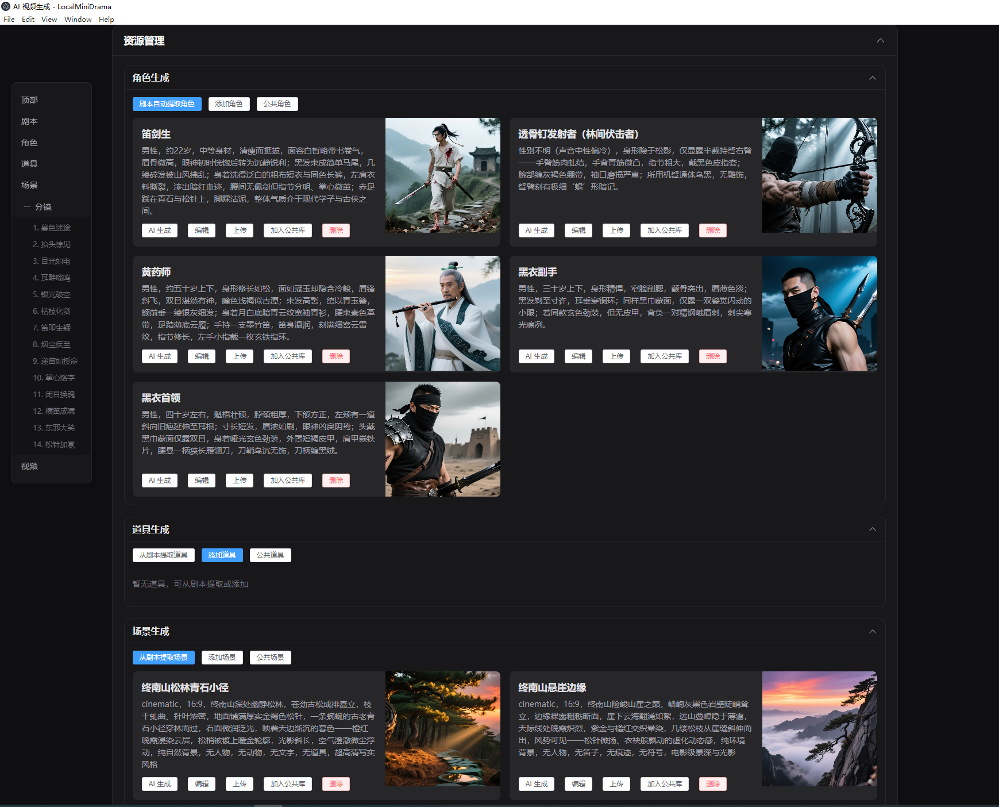
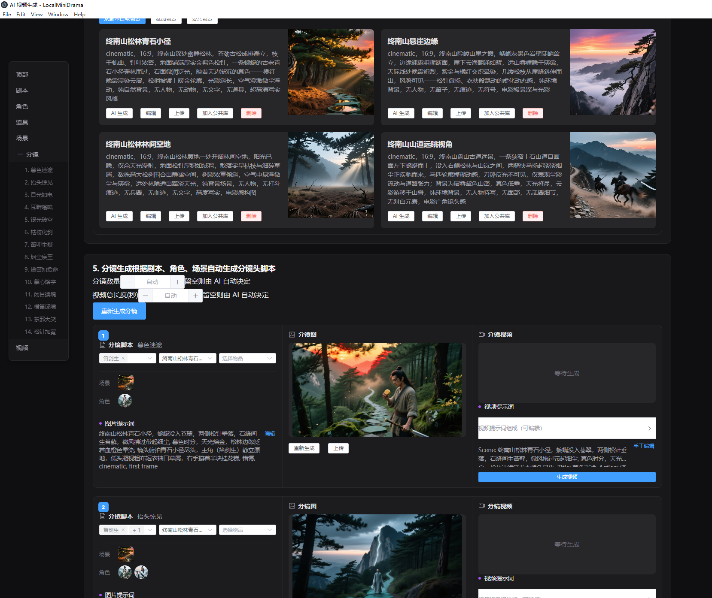

<div align="center">

# 🎬 LocalMiniDrama

**A locally-running AI short drama & comic generator — download and run, no cloud required, fully open source**

[](../../releases)
[](../LICENSE)
[](#)
[](#)
[](../../pulls)

**[中文](../README.md) | English | [Author's Story](story.md)**

</div>

---

There are plenty of AI short-drama tools out there, but almost none that truly run **offline locally, work out of the box, and keep your assets private**.  
This project is built entirely in JavaScript from scratch. Connect your own AI API and start generating your own AI short drama immediately.

> ✅ No subscription · ✅ Data stays local · ✅ Multiple AI providers · ✅ Fully open source

---

## 📸 Screenshots

<table>
  <tr>
    <td align="center"><br/><sub>Project list · Export/Import projects</sub></td>
    <td align="center"><br/><sub>Storyboard editor · One-click image + video generation</sub></td>
  </tr>
</table>

---

## ✨ Features

### 🔄 Full Creation Workflow

| Step | Feature | Description |
|:----:|---------|-------------|
| 1 | **Story Generation** | Enter a synopsis + style; AI generates a full multi-episode script |
| 2 | **Script Editing** | Manage episodes and freely edit script text |
| 3 | **Character Generation** | AI extracts characters; generate a portrait image for each |
| 4 | **Scene Generation** | Auto-extract scenes from script; generate scene background images |
| 5 | **Prop Generation** | Extract / manually add props; generate prop images |
| 6 | **Storyboard Generation** | Auto-generate storyboard per episode (shot type, camera, dialogue…) |
| 7 | **Image / Video Generation** | Generate still image and video clip for each shot |
| 8 | **Video Synthesis** | Automatically merge all shot videos into a complete episode |

### ⚡ One-Click Pipeline

- **Generate All**: Characters → Scenes → Storyboard → Images → Videos → Synthesis — fully automated
- **Fill & Generate**: Intelligently skips already-generated content; only fills what's missing
- **Auto Retry**: Up to 3 retries per step (handles 429 rate limits etc.); errors are logged and the pipeline continues
- **Live Progress**: Shows the current step and full error log in real time

### 🗂 Project & Asset Management

- **Project Export / Import**: Pack the full project as a ZIP (images, videos, text, configs); share or migrate with one file
- **Material Library**: Global character / scene / prop library reusable across projects; per-project and global libraries are strictly isolated
- **Aspect Ratio**: Set the ratio (16:9 / 9:16 / 1:1 …) when creating a project; all generated images and videos adapt automatically
- **Episode Management**: Add / delete episodes; script preview

### ✏️ Storyboard Fine Editing

- **Image Prompt**: View and edit the image-generation prompt for each shot; regenerate after changes
- **Video Prompt**: Edit the full prompt text, or expand the composition panel to edit individual fields (scene / duration / action / mood / camera / shot type) — auto-reassembled on save
- **Image Management**: AI generation, manual upload, drag-and-drop; replace at any time

### 🤖 AI Configuration

- Three independent model slots: **image generation**, **video generation**, **text generation**
- Compatible with **Alibaba DashScope**, **Volcengine (Doubao)**, **locally-deployed models** and any OpenAI-compatible API
- Visual config panel; changes take effect immediately; **connection test** supported
- Built-in quick-setup wizards for DashScope and Volcengine, with step-by-step API key instructions

### 🌓 UI / Theme

- **Dark mode** (default) and **Light mode** toggle, preference persisted
- Theme toggle available on every page

---

## 🚀 Quick Start

### Option A — Download exe (recommended)

Go to **[Releases](../../releases)** and download the latest:
- `LocalMiniDrama Setup x.x.x.exe` — NSIS installer
- `LocalMiniDrama x.x.x.exe` — portable, no install needed

Double-click → open **AI Config** → enter your API key → start creating.

> On first launch a config file is created at:  
> `%APPDATA%\LocalMiniDrama\backend\configs\config.yaml`

### Option B — Development Mode

> Requires Node.js >= 18

```bash
# 1. Clone
git clone https://github.com/your-username/LocalMiniDrama.git
cd LocalMiniDrama

# 2. Backend (port 5679)
cd backend-node
npm install
cp configs/config.example.yaml configs/config.yaml
# Edit config.yaml — set your AI API endpoint and key
npm run migrate   # first run: initialise DB
npm start

# 3. Frontend (new terminal, port 3013)
cd frontweb
npm install
npm run dev
```

Open `http://localhost:3013` in your browser.

You can also double-click `run_dev.bat` at the project root to **start both servers at once**.

📖 Full developer guide, packaging, and FAQ → **[Quickstart Guide](quickstart.md)**

---

## 🤖 AI Provider Support

| Provider | Text | Image | Video |
|----------|:----:|:-----:|:-----:|
| Alibaba DashScope (Qwen) | ✅ | ✅ | ✅ |
| Volcengine / Doubao | ✅ | ✅ | ✅ |
| Local (Ollama, OpenAI-compat.) | ✅ | — | — |
| Other OpenAI-compatible APIs | ✅ | ✅ | — |

📖 API key registration and configuration → **[Configuration Guide](configuration.md)**

---

## 🏗 Architecture

```
LocalMiniDrama/
├── backend-node/          # Node.js backend (Express + SQLite)
│   ├── src/
│   │   ├── config/        # YAML config loader
│   │   ├── db/            # SQLite connection & migrations
│   │   ├── services/      # Business logic (generation, export/import…)
│   │   └── routes/        # REST API routes
│   └── configs/           # config.yaml lives here
├── frontweb/              # Vue 3 frontend (Vite + Element Plus)
│   └── src/
│       ├── views/
│       │   ├── FilmList.vue      # Home: project list & material library
│       │   ├── DramaDetail.vue   # Drama: info / episodes / resource library
│       │   └── FilmCreate.vue    # Studio: script / characters / storyboard
│       ├── api/                  # Backend API wrappers
│       ├── stores/               # Pinia state management
│       └── styles/               # Global styles & theme variables
├── desktop/               # Electron shell (builds the exe)
├── docs/                  # Documentation
└── README.md
```

**Tech Stack:**

| Layer | Technology |
|-------|-----------|
| Frontend | Vue 3 + Vite + Element Plus + Pinia + Axios |
| Backend | Node.js + Express + SQLite (better-sqlite3) |
| Desktop | Electron 28 + electron-builder |
| Language | Plain JavaScript (no TypeScript) |

---

## 📋 Changelog

Full version history → **[CHANGELOG](changelog.md)**

**Latest v1.1.6 highlights:**
- 🆕 **Project Export / Import** — pack entire project as ZIP with all media and configs
- 🆕 **Aspect Ratio** — project-level ratio setting; all generation adapts automatically
- 🆕 **Extended Video Params** — `resolution`, `seed`, `camera_fixed`, `watermark` support
- 🆕 **Video Merge Progress** — real-time progress bar during episode synthesis
- 🔧 **Watermark-free Images** — Volcengine image generation disables watermark by default

---

## 🎯 Who Is This For

| User | Scenario |
|------|----------|
| 📹 Content creators | Batch-produce AI short dramas / comics |
| 🔒 Privacy-conscious users | Keep all assets local, no cloud uploads |
| 🛠 Developers | Extend AI providers or customise the pipeline |
| 🌱 Beginners | Explore the AI video space at zero cost |

---

## 🔗 Similar Tools

| Tool | Notes |
|------|-------|
| **Kino 视界** | Active Chinese AI short-drama platform; cloud-based, closed source |
| **Filmaction AI** | AI-driven plot / storyboard / voice; SaaS / web, partly paid |
| **oiioii** | Open source, lightweight AI visual creation, flexible deployment |
| **ChatFire** | AI dialogue-based short drama; inspired this project's backend design |

This project focuses on **local offline use, a friendly UI, and easy customisation**. Feel free to open an [Issue](../../issues) to recommend other tools.

---

## 🤝 Contributing

All contributions are welcome!

- 🐛 **Report a bug** → [New Issue](../../issues/new)
- 💡 **Suggest a feature** → [New Issue](../../issues/new)
- 🔧 **Submit code** → Fork → Edit → Pull Request
- ⭐ **Star the project** → Help others discover it

---

## 💬 About the Author

Just an ordinary game developer who got excited about the AI short-drama trend and built this open-source tool in JavaScript. Ship first, figure out the rest later.

Full story, inspirations, and acknowledgements → [Author's Story](story.md)

---

## 📄 License

[MIT](../LICENSE)

---

<div align="center">

**If this project helps you, a ⭐ Star is the best encouragement for the author!**

</div>
